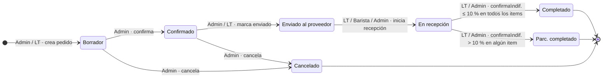
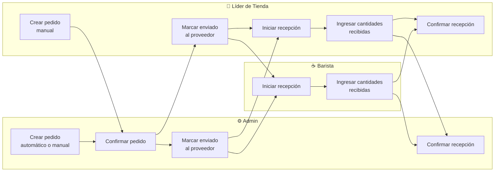
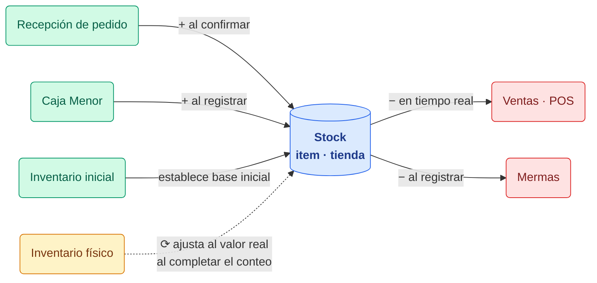
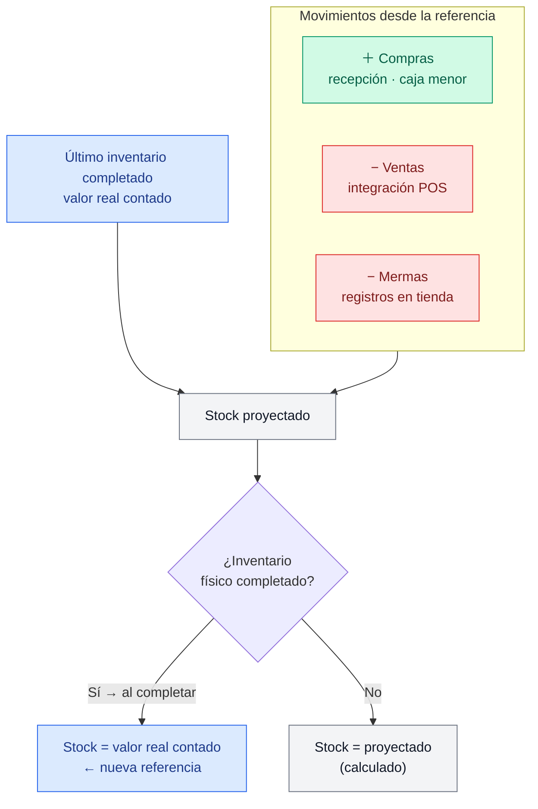

# Especificación Funcional del Sistema: Loopi v2

**Versión**: 2.0  
**Fecha**: 2026-05-17  
**Estado**: Borrador  
**Autor**: Equipo de Producto  
**Repositorio base (v1)**: `github.com/manuelgomezsw/loopi-api`

> **Nota de versión:** La v2.0 incorpora los hallazgos de la revisión par realizada el 2026-05-17. Ver sección 14 (Registro de Cambios) para el detalle completo de modificaciones.

---

## 1. Visión General del Sistema

Loopi v2 es un sistema de gestión de inventarios orientado a puntos de venta de café de especialidad. Su propósito central es darle al operador de tienda visibilidad en tiempo real sobre el stock de insumos, automatizar la proyección de pedidos y garantizar trazabilidad completa de todos los movimientos que afectan el inventario: compras, ventas (vía integración POS), mermas y conteos físicos.

El sistema soporta operaciones **multi-tienda** bajo una misma marca o empresa: cada tienda opera de forma autónoma sobre su propio inventario, mientras que el administrador tiene visibilidad consolidada o por tienda según lo requiera.

### 1.1 Problema que Resuelve

Los puntos de venta gestionan decenas de insumos con diferentes unidades de medida, múltiples proveedores y variabilidad en la demanda diaria. Sin un sistema centralizado, el operador pierde trazabilidad del stock, realiza pedidos subóptimos y no detecta mermas a tiempo. Cuando el negocio opera con varias tiendas, el problema se multiplica: el administrador no tiene visión consolidada ni puede comparar el desempeño entre locales. Loopi v2 cierra esa brecha.

### 1.2 Alcance del Sistema

**Dentro del alcance:**

- Gestión del catálogo compartido de items (insumos, materiales de consumo, activos)
- Gestión de recetas y menú de productos finales con soporte de variantes
- Conteo físico de inventario por tienda (diario, semanal, mensual)
- Registro de mermas por tienda
- Recepción de compras y pedidos por tienda
- Planeación de la demanda y generación automática de pedidos
- Integración con sistema POS para importar ventas por tienda
- Módulo de administración (empleados, proveedores, categorías, tiendas)
- Vistas consolidadas y por tienda para el administrador
- Flujo guiado de configuración inicial

**Fuera del alcance:**

- Registro manual de ventas (las ventas provienen exclusivamente del POS, con fallback manual)
- Facturación electrónica
- Gestión de cuentas por pagar a proveedores
- Catálogos de items independientes por tienda (el catálogo es compartido a nivel de marca)

---

## 2. Usuarios, Roles y Tiendas

### 2.1 Roles del Sistema

| Rol | Descripción | Ámbito |
|-----|-------------|--------|
| `admin` | Administrador del negocio o marca | Acceso total a todas las tiendas: catálogo, reportes, pedidos, configuración, vistas consolidadas |
| `lider_tienda` | Líder de turno responsable del conteo | Operaciones de su tienda asignada: inventario, mermas, ajustes, recepción de compras |
| `barista` | Empleado de tienda | Lectura del inventario de su tienda; puede iniciar y registrar la recepción de pedidos enviados |

### 2.2 Autenticación

- Autenticación mediante usuario y contraseña con token JWT.
- El token incluye el `rol` y, para `lider_tienda` y `barista`, el `tienda_id` asignado.
- El token tiene expiración configurable (por defecto 24 horas).
- El `admin` puede crear, activar/inactivar y resetear contraseña de empleados.
- Un empleado inactivo no puede autenticarse.
- El `admin` no está restringido a una tienda; su token no lleva `tienda_id` fijo y puede seleccionar el contexto de tienda en la interfaz.

### 2.3 Gestión de Tiendas

#### 2.3.1 Descripción

Una **tienda** representa un punto de venta físico de la marca. Toda operación (inventario, compras, pedidos, mermas, ventas) ocurre en el contexto de una tienda. El catálogo de items, recetas, menú, categorías y proveedores es **compartido** entre todas las tiendas de la misma marca.

#### 2.3.2 Atributos de una Tienda

| Campo | Descripción |
|-------|-------------|
| `nombre` | Nombre del local o punto de venta |
| `direccion` | Dirección física |
| `ciudad` | Ciudad de operación |
| `telefono` | Teléfono de contacto |
| `activo` | Si la tienda opera actualmente |

#### 2.3.3 Reglas de Negocio

- RN-TDA-01: Solo el `admin` puede crear y gestionar tiendas.
- RN-TDA-02: El `lider_tienda` y el `barista` están asignados a exactamente una tienda. No pueden ver datos de otras tiendas.
- RN-TDA-03: El `admin` puede cambiar la tienda asignada a un empleado.
- RN-TDA-04: Una tienda inactiva no puede iniciar nuevos inventarios ni pedidos, pero conserva su historial.
- RN-TDA-05: Todos los módulos operacionales (inventarios, compras, pedidos, mermas, ventas, ajustes) llevan `tienda_id`.

### 2.4 Vistas del Admin: Consolidadas vs por Tienda

El `admin` tiene dos modos de navegación:

| Modo | Descripción | Disponible en |
|------|-------------|---------------|
| **Consolidado** | Vista agregada de todas las tiendas activas | Dashboard principal, alertas de stock bajo, mermas del período |
| **Por tienda** | Vista idéntica a la del líder, filtrando por tienda seleccionada | Todos los módulos operacionales |

La selección de tienda se realiza desde un selector global visible en la interfaz del admin. Si no selecciona tienda, se muestra la vista consolidada.

### 2.5 Matriz de Permisos

| Acción | `admin` | `lider_tienda` | `barista` |
|--------|:-------:|:--------------:|:---------:|
| Crear/editar tiendas | ✓ | — | — |
| Crear/editar empleados | ✓ | — | — |
| Resetear contraseñas | ✓ | — | — |
| Gestionar catálogo (items, categorías, UM, proveedores) | ✓ | — | — |
| Ver catálogo | ✓ | ✓ | ✓ |
| Gestionar menú y recetas | ✓ | — | — |
| Iniciar inventario (propia tienda) | ✓ | ✓ | — |
| Registrar conteo físico (propia tienda) | ✓ | ✓ | — |
| Completar inventario (propia tienda) | ✓ | ✓ | — |
| Ver inventarios (propia tienda) | ✓ | ✓ | ✓ |
| Ver inventarios (todas las tiendas) | ✓ | — | — |
| Registrar merma (propia tienda) | ✓ | ✓ | — |
| Anular merma | ✓ | — | — |
| Ver mermas (propia tienda) | ✓ | ✓ | — |
| Ver mermas (todas las tiendas) | ✓ | — | — |
| Crear/confirmar pedidos | ✓ | — | — |
| Cancelar pedido | ✓ | — | — |
| Ver pedidos (propia tienda) | ✓ | ✓ | ✓ |
| Iniciar recepción de pedido (propia tienda) | ✓ | ✓ | ✓ |
| Registrar cantidades recibidas (propia tienda) | ✓ | ✓ | ✓ |
| Confirmar recepción de pedido | ✓ | ✓ | — |
| Registrar compra caja menor (propia tienda) | ✓ | ✓ | — |
| Ver ventas POS (propia tienda) | ✓ | ✓ | — |
| Importar/confirmar ventas archivo plano | ✓ | — | — |
| Ver dashboard consolidado | ✓ | — | — |
| Ver dashboard de tienda | ✓ | ✓ | ✓ (limitado) |
| Gestionar picos de demanda | ✓ | — | — |
| Ver historial de costos | ✓ | — | — |
| Configuración inicial del sistema | ✓ | — | — |

---

## 3. Módulos del Sistema

### 3.1 Módulo: Catálogo — Submenú Items (Insumos)

#### 3.1.1 Descripción

El catálogo de items es el maestro central del sistema. Es **compartido entre todas las tiendas** de la marca: el `admin` lo gestiona centralmente y cada tienda opera sobre él. Representa todos los insumos, materiales de consumo y activos que se gestionan en inventario.

#### 3.1.2 Atributos de un Item

| Campo | Tipo | Descripción |
|-------|------|-------------|
| `codigo` | Texto | Código único del item ingresado manualmente (ej: CAF-001, LEC-002) |
| `nombre` | Texto | Nombre único del item |
| `tipo` | Enum | `insumo`, `material_consumo`, `activo` |
| `categoria` | Referencia | Clasificación principal (ej: Lácteos, Carnes) |
| `subcategoria` | Referencia | Clasificación secundaria dentro de la categoría (ej: Quesos, Embutidos) |
| `proveedor` | Referencia | Proveedor habitual del item |
| `unidad_medida` | Referencia | Unidad en la que el sistema calcula el inventario (unidad canónica) |
| `costo_unitario_referencia` | Entero (COP) | Costo de referencia por unidad, en pesos sin decimales. El costo real por tienda se gestiona en el historial de costos. |
| `frecuencia_inventario` | Enum | `diario`, `semanal`, `mensual` |
| `stock_seguridad` | Entero | Cantidad mínima de stock que siempre se debe mantener |
| `tiempo_entrega_dias` | Entero | Días que tarda el proveedor en entregar este item |
| `activo` | Booleano | Si el item participa en los inventarios |

#### 3.1.3 Categorización en Dos Niveles

- **Categoría**: Clasificación principal (Insumo, Lacteo, Verdura, Abarrote, Material de consumo, Activo, etc.).
- **Subcategoría**: Clasificación secundaria dentro de la categoría (ej: dentro de Lacteo → Quesos, Cremas; dentro de Verdura → Hoja, Raíz).
- Una subcategoría pertenece a exactamente una categoría.
- Un item pertenece a exactamente una subcategoría.

#### 3.1.4 Historial de Costos por Tienda

Cada tienda mantiene un historial de costos independiente para cada item. El costo real se actualiza con cada recepción de compra confirmada. Ver entidad `historico_costo_item` en sección 7.

#### 3.1.5 Reglas de Negocio

- RN-ITEM-01: El `codigo` del item es único en todo el sistema. Es asignado manualmente por el admin al crear el item.
- RN-ITEM-01b: El nombre del item es único en todo el sistema.
- RN-ITEM-02: No se elimina un item; solo se inactiva. Un item inactivo no aparece en futuros inventarios pero conserva su historial.
- RN-ITEM-03: El `costo_unitario_referencia` debe expresarse en la misma `unidad_medida` definida para el item.
- RN-ITEM-04: El `tiempo_entrega_dias` es el insumo principal para el cálculo del pedido automático.
- RN-ITEM-05: La `frecuencia_inventario` determina en qué tipo de conteo se incluye el item: los items `diario` aparecen en todos los conteos; `semanal` solo en conteos semanales y mensuales; `mensual` solo en conteos mensuales.

---

### 3.2 Módulo: Tabla de Equivalencias (Unidades de Medida)

#### 3.2.1 Descripción

Define las unidades de medida del sistema y las equivalencias entre ellas. El sistema trabaja siempre en la unidad canónica definida por item (ej: el Tomate se mide en gramos, el Aceite en mililitros). Este catálogo es compartido entre todas las tiendas.

#### 3.2.2 Atributos de una Unidad de Medida

| Campo | Descripción |
|-------|-------------|
| `codigo` | Código corto (ej: `g`, `kg`, `ml`, `l`, `und`, `cm2`) |
| `nombre` | Nombre completo (Gramos, Kilogramos, Mililitros, etc.) |
| `tipo_medida` | Agrupación: `peso`, `volumen`, `unidad`, `area` |
| `factor_conversion` | Factor respecto a la unidad base del tipo (ej: 1 kg = 1000 g) |
| `unidad_base` | Unidad de referencia del tipo (ej: para peso la base es `g`) |

#### 3.2.3 Reglas de Negocio

- RN-EQ-01: Cada item tiene asignada exactamente una unidad de medida canónica. Todos los cálculos de inventario (conteos, recetas, mermas, compras) se expresan en esa unidad.
- RN-EQ-02: Las recetas y las líneas de compra pueden especificar cantidades en unidades distintas a la canónica del item; el sistema convierte automáticamente usando los factores de equivalencia.
- RN-EQ-03: El catálogo de unidades de medida es gestionado solo por el `admin`.

#### 3.2.4 Ejemplos de Equivalencias

| Item | Unidad Canónica | Unidad en Receta/Compra | Factor |
|------|----------------|------------------------|--------|
| Tomate | gramos (g) | gramos (g) | 1.0 |
| Aceite oliva | mililitros (ml) | mililitros (ml) | 1.0 |
| Harina | gramos (g) | kilogramos (kg) | 1000.0 |
| Pan artesanal | unidad (und) | unidad (und) | 1.0 |

---

### 3.3 Módulo: Catálogo — Submenú Productos (Menú y Recetas)

#### 3.3.1 Descripción del Menú

El Menú es el catálogo de productos finales que se venden al cliente. Es compartido entre todas las tiendas de la marca. Cada producto del menú puede tener variantes (ej: tamaños S/M/L) y una receta activa asociada por variante.

#### 3.3.2 Atributos de un Producto de Menú

| Campo | Descripción |
|-------|-------------|
| `nombre` | Nombre base del producto (ej: "Latte") |
| `categoria_menu` | Agrupación para el menú (Bebidas, Sanduchería, Postres, etc.) |
| `producto_padre` | Referencia opcional a otro producto de menú. Permite agrupar variantes bajo un mismo producto padre. |
| `precio_venta` | Precio de venta al público (COP) |
| `codigo_pos` | Identificador del producto en el sistema POS externo. Único por tienda. |
| `activo` | Si el producto está activo en el menú |

#### 3.3.3 Variantes de Producto

Un producto puede tener **variantes** que representan presentaciones distintas del mismo artículo (ej: tamaños, sabores) con diferente receta y/o precio. Cada variante se modela como un **producto de menú independiente** vinculado a su producto padre mediante el campo `producto_padre`.

**Ejemplo:**

```text
Producto padre: Latte (sin código POS, sin receta directa)
  ↳ Variante: Latte S  | codigo_pos: LAT-S | precio: $6.000 | receta: 150ml leche, 30ml espresso
  ↳ Variante: Latte M  | codigo_pos: LAT-M | precio: $8.000 | receta: 200ml leche, 45ml espresso
  ↳ Variante: Latte L  | codigo_pos: LAT-L | precio: $9.500 | receta: 300ml leche, 60ml espresso
```

- Los productos padre son agrupadores de menú; no tienen `codigo_pos` ni receta propia.
- Cada variante (producto hijo) tiene su `codigo_pos`, precio y receta independientes.
- Un producto sin `producto_padre` es un producto de menú simple (no tiene variantes).

#### 3.3.4 Descripción de las Recetas

Una receta define la composición de items necesarios para preparar una unidad del producto de menú. Es el puente entre las ventas (productos finales) y el inventario (insumos).

#### 3.3.5 Atributos de una Receta

| Campo | Descripción |
|-------|-------------|
| `producto_menu` | Producto o variante al que pertenece esta receta |
| `version` | Versión activa de la receta (historial de cambios) |
| `activa_desde` | Fecha de entrada en vigencia de esta versión |
| `lineas` | Lista de items con cantidad y unidad |

#### 3.3.6 Atributos de una Línea de Receta

| Campo | Descripción |
|-------|-------------|
| `item` | Referencia al insumo del catálogo |
| `cantidad` | Cantidad del insumo a consumir |
| `unidad_medida` | Unidad en que se expresa la cantidad (puede diferir de la canónica) |

#### 3.3.7 Ejemplo

```text
Producto: Sanduche Capresse
Receta v1 (activa desde 2026-01-01):
  - Pan artesanal  | 2    | unidad
  - Tomate         | 30   | gramos
  - Lechuga        | 25   | gramos
  - Pollo          | 120  | gramos
  - Salsa pesto    | 20   | mililitros
  - Salsa tomate   | 30   | mililitros
```

#### 3.3.8 Reglas de Negocio

- RN-REC-01: Cada producto de menú (o variante) puede tener como máximo una receta activa.
- RN-REC-02: Modificar una receta no elimina la anterior; se crea una nueva versión y la anterior queda archivada para trazabilidad histórica.
- RN-REC-03: Si un producto no tiene receta activa, las ventas de ese producto no generan descuento de inventario (se registra una alerta).
- RN-REC-04: La cantidad de cada insumo en la receta debe ser mayor que cero.
- RN-REC-05: Las unidades de medida de las líneas de receta deben tener equivalencia configurada con la unidad canónica del item correspondiente.
- RN-REC-06: Un producto padre no puede tener receta propia; solo sus variantes la tienen.
- RN-REC-07: Para eliminar un `producto_padre`, primero deben inactivarse todas sus variantes.

---

### 3.4 Módulo: Inventario (Conteo Físico)

#### 3.4.1 Descripción

El inventario es el módulo central del sistema. Representa el conteo físico periódico realizado por el líder de tienda para verificar el stock real contra el stock proyectado. Cada inventario pertenece a una tienda.

#### 3.4.2 Tipos de Inventario

| Tipo | Frecuencia | Horarios | Items incluidos |
|------|-----------|---------|----------------|
| `diario` | Diario | Apertura, Mediodía, Cierre | Items con frecuencia `diario` |
| `semanal` | Semanal (día fijo) | — | Items con frecuencia `diario` y `semanal` |
| `mensual` | Mensual (día fijo) | — | Todos los items activos |
| `inicial` | Una vez (carga inicial) | — | Todos los items activos |

#### 3.4.3 Selección del Tipo de Inventario

Al iniciar un inventario, el sistema **sugiere** el tipo y horario basándose en la hora actual y el estado de los inventarios del día:

- Entre 06:00 y 10:59 → sugiere `diario / apertura`
- Entre 11:00 y 14:59 → sugiere `diario / mediodía`
- Entre 15:00 y 23:59 → sugiere `diario / cierre`

El líder puede **confirmar la sugerencia o cambiarla manualmente** seleccionando otro tipo (`diario`, `semanal`, `mensual`, `inicial`) y horario. Esto permite realizar conteos no planificados (ej: inventario mensual fuera de la fecha habitual) sin restricción de horario.

#### 3.4.4 Ciclo de Vida de un Inventario

```text
CREADO (en_progreso)
    ↓ El líder registra el conteo físico item por item
    ↓ El sistema calcula discrepancias en tiempo real
    ↓ El líder revisa y confirma
COMPLETADO
```

#### 3.4.5 Atributos de un Inventario

| Campo | Descripción |
|-------|-------------|
| `tienda` | Tienda a la que pertenece el inventario |
| `fecha` | Fecha del conteo |
| `tipo` | `diario`, `semanal`, `mensual`, `inicial` |
| `horario` | Para tipo `diario`: `apertura`, `mediodia`, `cierre` |
| `estado` | `en_progreso`, `completado` |
| `responsable` | Empleado que realizó el conteo |
| `iniciado_en` | Timestamp de inicio |
| `completado_en` | Timestamp de finalización |

#### 3.4.6 Detalle de Inventario por Item

| Campo | Descripción |
|-------|-------------|
| `item` | Item contado |
| `inventario_referencia` | Inventario completado más reciente (de cualquier tipo y horario) usado como punto de partida para el valor sugerido |
| `valor_sugerido` | Stock proyectado desde el inventario de referencia + movimientos posteriores hasta el inicio de este inventario (ver sección 5.2) |
| `ventas_periodo` | Unidades descontadas por ventas desde el inventario de referencia |
| `compras_periodo` | Unidades recibidas por compras desde el inventario de referencia |
| `mermas_periodo` | Unidades registradas como merma desde el inventario de referencia |
| `valor_esperado` | Calculado: `valor_sugerido` (ya incluye los movimientos del período) |
| `valor_real` | Conteo físico registrado por el líder |
| `diferencia` | `real - esperado` (positivo = sobrante, negativo = faltante) |

#### 3.4.7 Reglas de Negocio

- RN-INV-01: Solo puede existir un inventario `en_progreso` por tienda, tipo y horario en una misma fecha.
- RN-INV-02: El `inventario_referencia` de cada item es el inventario completado más reciente para esa tienda, independientemente del tipo y horario.
- RN-INV-03: Para completar un inventario, todos los items deben tener registrado el `valor_real`.
- RN-INV-04: El inventario de tipo `inicial` no requiere inventario de referencia previo; establece el stock de referencia inaugural de la tienda.
- RN-INV-05: Al confirmar un inventario, las diferencias encontradas **ajustan el stock automáticamente** al valor real contado. No se requiere aprobación de un rol superior.
- RN-INV-06: El inventario `en_progreso` puede ser retomado por el mismo responsable si se interrumpe.
- RN-INV-07: **Quien inicia y diligencia el conteo puede finalizarlo**, independientemente del rol (admin, lider_tienda o barista). No existe restricción de rol para completar.
- RN-INV-08: Un inventario completado no puede modificarse directamente. Las correcciones posteriores se registran como mermas (si aplica) o mediante un nuevo inventario.

---

### 3.5 Módulo: Mermas

#### 3.5.1 Descripción

Las mermas representan la pérdida de inventario por causas distintas a las ventas: descuadres, robos, evaporación, vencimientos, daños en almacén. Todo registro de merma **impacta el inventario** en el mismo momento de ser guardado. Cada merma pertenece a una tienda.

#### 3.5.2 Atributos de una Merma

| Campo | Descripción |
|-------|-------------|
| `tienda` | Tienda donde ocurre la merma |
| `item` | Item afectado |
| `cantidad` | Cantidad perdida (en la unidad canónica del item) |
| `motivo` | Enum: `descuadre`, `robo`, `evaporacion`, `vencimiento`, `daño`, `otro` |
| `descripcion` | Nota descriptiva opcional |
| `fecha` | Fecha del evento |
| `registrado_por` | Empleado que registró la merma |
| `inventario_asociado` | Inventario al que se asocia (opcional; si se registra durante un conteo) |
| `costo_total` | Campo calculado para visualización: `cantidad × costo_unitario_referencia` del item. No se almacena; se calcula al mostrar el listado. |

#### 3.5.3 Reglas de Negocio

- RN-MERM-01: Una merma puede registrarse en cualquier momento del día, con o sin un inventario activo.
- RN-MERM-02: Al registrar una merma, el sistema descuenta inmediatamente la cantidad del stock proyectado del item en la tienda correspondiente.
- RN-MERM-03: Las mermas asociadas a un período de inventario se acumulan en el campo `mermas_periodo` del detalle de inventario correspondiente.
- RN-MERM-04: Las mermas no se eliminan; se pueden anular (registrando el motivo de anulación), lo que revierte el impacto en inventario. Solo el `admin` puede anular mermas.
- RN-MERM-05: El admin puede ver el reporte consolidado de mermas por item, por período, por motivo y por tienda.

---

### 3.6 Módulo: Ventas (Integración POS)

#### 3.6.1 Descripción

Las ventas **no se registran manualmente** en Loopi v2. Provienen de la integración con el sistema POS (Point of Sale) externo. Cada venta de un producto de menú activa el descuento de inventario de los insumos que componen su receta. Las ventas se procesan en el contexto de la tienda asociada al POS.

#### 3.6.2 Modos de Integración

| Modo | Descripción | Cuándo usar |
|------|-------------|-------------|
| **Servicio web (API)** | El POS envía las ventas en tiempo real o por lote vía HTTP | POS con capacidad de integración REST |
| **Archivo plano** | Se importa un archivo CSV/Excel con las ventas del período | POS sin API; exportación manual |

#### 3.6.3 Estructura de la Venta Importada

| Campo | Descripción |
|-------|-------------|
| `fecha_hora` | Timestamp de la venta |
| `tienda_id` | Identificador de la tienda donde ocurrió la venta |
| `codigo_pos` | Código del producto en el POS |
| `cantidad` | Unidades vendidas |
| `numero_ticket` | Referencia del ticket de caja (clave de idempotencia: si ya existe, el registro se descarta) |

#### 3.6.4 Flujo de Procesamiento de Ventas

```text
1. El POS envía la venta (o se importa el archivo)
2. El sistema verifica idempotencia por numero_ticket + tienda_id
3. Si ya existe → descarta el registro, log con estado "duplicada"
4. El sistema busca el producto de menú por codigo_pos y tienda
5. El sistema obtiene la receta activa del producto
6. Por cada línea de receta: descuenta (cantidad_vendida × cantidad_receta) del inventario de la tienda
7. Si el producto no tiene receta activa → alerta al admin, la venta queda en estado "pendiente_receta"
8. Si el item de la receta tiene stock insuficiente → se registra stock negativo y alerta
```

#### 3.6.5 Estados de una Venta Importada

| Estado | Descripción |
|--------|-------------|
| `procesada` | Venta procesada correctamente; inventario descontado |
| `duplicada` | `numero_ticket` ya existía; descartada sin impacto |
| `pendiente_receta` | El producto no tiene receta activa; en cola para reprocessing |
| `error` | Error técnico en el procesamiento |

#### 3.6.6 Reglas de Negocio

- RN-VTA-01: El sistema no registra ventas propias; solo procesa las que llegan del POS.
- RN-VTA-02: Cada venta genera descuentos de inventario calculados con la receta vigente al momento de la venta.
- RN-VTA-03: Si una venta corresponde a un producto sin receta activa, no genera descuento pero queda en estado `pendiente_receta` para que el admin asigne la receta y reprocess.
- RN-VTA-04: Las ventas importadas por archivo plano requieren confirmación del admin antes de impactar inventario.
- RN-VTA-05: El sistema mantiene log de todas las ventas importadas con su estado.
- RN-VTA-06: En caso de que el POS no esté disponible, el líder de tienda puede ingresar manualmente el resumen de ventas del período (cantidad por producto) durante el cierre de inventario.

---

### 3.7 Módulo: Caja Menor (Compras Excepcionales)

#### 3.7.1 Descripción

El módulo de Caja Menor permite registrar compras imprevistas de items **sin pedido previo**: insumos de baja rotación, urgencias o reposiciones de emergencia. Cada registro **impacta el inventario** de la tienda sumando stock inmediatamente.

> **Nota:** La recepción de pedidos planificados (con pedido activo) se gestiona dentro del módulo de Pedidos (§3.8), no en este módulo.

#### 3.7.2 Configuración de Items Habilitados para Caja Menor

El `admin` define qué items pueden comprarse excepcionalmente por caja menor. Esta lista se configura en el módulo de Administración y es visible para el líder al registrar una compra.

#### 3.7.3 Atributos de una Compra Caja Menor

| Campo | Descripción |
|-------|-------------|
| `tienda` | Tienda que realiza la compra |
| `item` | Item habilitado para caja menor (seleccionado de la lista configurada) |
| `unidad_medida` | Unidad canónica del item (cargada automáticamente al seleccionar el item) |
| `cantidad` | Cantidad comprada en la unidad canónica |
| `valor_unitario` | Valor pagado por unidad (COP) |
| `valor_total` | Calculado: `cantidad × valor_unitario` |
| `motivo` | Nota explicativa obligatoria (ej: "emergencia por quiebre de stock") |
| `fecha` | Fecha de la compra |
| `registrado_por` | Empleado que registró la compra |

#### 3.7.4 Reglas de Negocio

- RN-CM-01: Solo pueden registrarse compras de items que el admin haya habilitado para caja menor.
- RN-CM-02: Al confirmar la compra, el sistema suma la cantidad al stock del item en la tienda.
- RN-CM-03: Toda compra de caja menor requiere un motivo. Sin motivo, no se puede guardar.
- RN-CM-04: Solo el `lider_tienda` o `admin` pueden registrar compras de caja menor.
- RN-CM-05: Una compra de caja menor confirmada no se puede eliminar; si hubo error, se registra como merma o devolución.

---

### 3.8 Módulo: Pedidos

#### 3.8.1 Descripción

Los pedidos son órdenes de compra generadas para los proveedores, asociadas a una tienda. El sistema puede generar pedidos sugeridos automáticamente basándose en el algoritmo de Planeación de Demanda, o el admin puede crearlos manualmente.

#### 3.8.2 Ciclo de Vida de un Pedido



| Transición | Trigger | Rol autorizado |
|-----------|---------|----------------|
| BORRADOR → CONFIRMADO | Revisión y confirmación del pedido | `admin` |
| CONFIRMADO → ENVIADO_AL_PROVEEDOR | Notificación enviada al proveedor | `admin`, `lider_tienda` |
| ENVIADO → EN_RECEPCIÓN | Inicio del proceso de recepción en tienda | `lider_tienda`, `barista`, `admin` |
| EN_RECEPCIÓN → COMPLETADO | Confirmación de recepción dentro de tolerancia | `lider_tienda`, `admin` |
| EN_RECEPCIÓN → PARCIALMENTE_COMPLETADO | Confirmación con diferencia > tolerancia | `lider_tienda`, `admin` |
| BORRADOR → CANCELADO | Cancelación manual | `admin` |
| CONFIRMADO → CANCELADO | Cancelación manual con justificación | `admin` |

#### 3.8.3 Expiración de Pedidos en BORRADOR

Un pedido en estado `borrador` que no haya sido confirmado en N días (configurable, por defecto 3 días hábiles) genera una alerta al `admin`. El pedido no se cancela automáticamente; requiere acción manual.

#### 3.8.4 Atributos de un Pedido (Cabecera)

| Campo | Descripción |
|-------|-------------|
| `tienda` | Tienda que genera el pedido |
| `proveedor` | Proveedor al que se dirige el pedido |
| `fecha_pedido` | Fecha de generación del pedido |
| `fecha_entrega_esperada` | Fecha esperada de entrega según tiempo de entrega del proveedor |
| `estado` | `borrador`, `confirmado`, `enviado`, `en_recepcion`, `completado`, `parcialmente_completado`, `cancelado` |
| `generado_por` | `automatico` (demand planning) o `manual` |
| `semana` | Semana ISO del pedido |
| `notas` | Observaciones adicionales |
| `motivo_cancelacion` | Obligatorio si `estado = cancelado` |

#### 3.8.5 Atributos de una Línea de Pedido

| Campo | Descripción |
|-------|-------------|
| `item` | Item a pedir |
| `cantidad_sugerida` | Calculada por demand planning |
| `cantidad_final` | Cantidad ajustada por el admin (si difiere de la sugerida) |
| `costo_estimado` | `cantidad_final × costo_unitario_referencia_item` |

#### 3.8.6 Reglas de Negocio

- RN-PED-01: Un pedido en estado `borrador` puede modificarse libremente.
- RN-PED-02: Al pasar a `confirmado`, el pedido queda bloqueado para edición (solo admin con permiso especial puede modificarlo).
- RN-PED-03: Solo se puede crear un pedido activo (no cancelado, no completado) por tienda y proveedor por semana.
- RN-PED-04: El admin puede combinar o dividir pedidos antes de confirmarlos.
- RN-PED-05: Un pedido `completado` es aquel donde todos los items se recibieron dentro de tolerancia (≤10% de diferencia). Si hay diferencia mayor en al menos un item, pasa a `parcialmente_completado`.
- RN-PED-06: Los pedidos se agrupan por proveedor (un pedido por proveedor por tienda por semana).

#### 3.8.7 Subflujo: Recepción de Pedido

La recepción es el proceso por el cual el líder o barista registra las cantidades reales recibidas cuando el proveedor llega a la tienda. Este subflujo vive dentro del módulo de Pedidos.

**Flujo:**

1. El `lider_tienda` o `barista` accede al submenú **Recepción** y ve la lista de pedidos en estado `enviado`.
2. Selecciona el pedido a recibir y hace clic en **Iniciar recepción** → el pedido pasa a `en_recepcion`.
3. El sistema despliega la lista de items del pedido con la cantidad pedida por cada uno.
4. El líder o barista ingresa la cantidad realmente recibida por cada item.
5. El sistema calcula en tiempo real la diferencia por item (recibida − pedida).
6. Al confirmar la recepción:
   - Si la diferencia en todos los items ≤ 10%: estado `completado`.
   - Si la diferencia en al menos un item > 10%: estado `parcialmente_completado`.
   - El sistema suma `cantidad_recibida_canonico` al stock de cada item en la tienda.
7. Solo el `lider_tienda` o `admin` pueden confirmar la recepción (paso 6). El barista puede iniciar y registrar cantidades pero no confirmar.

**Atributos de una Línea de Recepción:**

| Campo | Descripción |
|-------|-------------|
| `item` | Item del pedido |
| `unidad_medida_recepcion` | Unidad en que el proveedor entrega (puede diferir de la canónica) |
| `cantidad_pedida` | Cantidad del pedido original |
| `cantidad_recibida` | Cantidad efectivamente recibida |
| `cantidad_recibida_canonico` | Convertida a unidad canónica del item |
| `costo_unitario` | Costo real al que se recibió (actualiza el historial de costos del item) |
| `diferencia` | `recibida − pedida` (positivo = excedente, negativo = faltante) |

#### 3.8.8 Diagrama de Roles — Flujo Completo (Pedido + Recepción)



---

### 3.9 Módulo: Planeación de Demanda

#### 3.9.1 Descripción

La Planeación de Demanda es el motor que calcula cuánto pedir de cada item para una tienda, basándose en el stock actual, el comportamiento histórico de ventas de esa tienda y los parámetros de cada item.

#### 3.9.2 Algoritmo de Cálculo de Pedido

Para cada item activo con proveedor asignado, por tienda:

```text
inventario_actual     = stock_real del último inventario completado de la tienda
promedio_venta_diaria = promedio de unidades consumidas por ventas de la tienda
                        en los últimos N días (configurable, por defecto 14)
tiempo_entrega        = item.tiempo_entrega_dias
stock_seguridad       = item.stock_seguridad
pico_demanda          = pico definido para la semana del pedido (configurable por semana)

-- Condición de pedido --
Si (inventario_actual > promedio_venta_diaria × tiempo_entrega):
    cantidad_a_pedir = 0  → No se incluye en el pedido
Sino:
    cantidad_a_pedir = (promedio_venta_diaria × tiempo_entrega) + stock_seguridad + pico_demanda
```

#### 3.9.3 Configuración de Picos de Demanda

El admin puede registrar semanas especiales con multiplicadores o cantidades adicionales por item y tienda:

| Campo | Descripción |
|-------|-------------|
| `tienda` | Tienda afectada (o `todas` para aplicar a todas las tiendas) |
| `semana` | Semana ISO (ej: 2026-W20) |
| `item` | Item afectado |
| `tipo` | `multiplicador` (factor sobre promedio) o `cantidad_adicional` |
| `valor` | Valor del multiplicador o cantidad adicional |

#### 3.9.4 Parámetros Globales del Algoritmo

| Parámetro | Descripción | Valor por defecto |
|-----------|-------------|------------------|
| `ventana_historico_dias` | Días hacia atrás para calcular promedio de ventas | 14 |
| `dia_generacion_pedido` | Día de la semana para generar el pedido | Lunes |
| `tolerancia_diferencia_pct` | % de diferencia aceptable en recepción | 10% |

#### 3.9.5 Reglas de Negocio

- RN-PL-01: El cálculo de `promedio_venta_diaria` usa las ventas procesadas del POS de la tienda dentro de la ventana histórica.
- RN-PL-02: Si un item no tiene historial de ventas suficiente (< 7 días) en la tienda, se usa el `stock_seguridad` como cantidad a pedir.
- RN-PL-03: El admin puede sobrescribir la cantidad sugerida antes de confirmar el pedido.
- RN-PL-04: La generación del pedido automático se realiza en el día configurado; el admin recibe una notificación.
- RN-PL-05: Los picos de demanda se configuran con al menos 48 horas de anticipación a la generación del pedido.

---

### 3.10 Módulo: Ajustes de Inventario

> **⚠️ Deprecado en v2.** Este módulo fue eliminado tras revisión con el equipo (2026-05-18). Las diferencias detectadas en el conteo ajustan el stock directamente al confirmar el inventario (RN-INV-05), sin flujo de aprobación separado. Las correcciones posteriores a un inventario completado se registran como mermas (si son pérdidas) o mediante un nuevo inventario de tipo `inicial` o `semanal`.

---

## 4. Módulos Transversales

### 4.1 Gestión de Empleados

- CRUD completo por el admin.
- Campos: nombre, apellido, usuario, tipo de documento, número de documento, teléfono, email, fecha nacimiento, rol, tienda asignada, activo.
- El campo `tienda_asignada` es obligatorio para roles `lider_tienda` y `barista`. El `admin` no tiene tienda asignada fija.
- El admin puede resetear contraseña de cualquier empleado.
- Un empleado inactivo no puede autenticarse.

### 4.2 Gestión de Proveedores

- CRUD completo por el admin.
- Campos: razón social, NIT, nombre contacto, teléfono contacto, email contacto, activo.
- Un proveedor puede ser asignado a múltiples items.
- Un proveedor inactivo no aparece en el flujo de pedidos.
- El catálogo de proveedores es compartido entre todas las tiendas.

### 4.3 Dashboard Administrativo

El `admin` tiene acceso a un panel con dos modos:

**Vista Consolidada (todas las tiendas):**

- Estado del día por tienda: inventarios pendientes, en progreso, completados.
- Items con stock bajo en cualquier tienda (por debajo del `stock_seguridad`).
- Mermas del día agregadas por tienda y motivo.
- Discrepancias abiertas en la última ronda de inventarios.
- Pedidos activos por tienda y estado.

**Vista por Tienda (idéntica a la del líder):**

- Inventarios del día (estado de cada conteo: pendiente, en progreso, completado).
- Items con stock bajo en la tienda seleccionada.
- Mermas del día/semana (resumen por motivo y monto en COP).
- Discrepancias abiertas (items con diferencia en último inventario de la tienda).
- Estado del último pedido de la tienda.
- Ajustes pendientes de aprobación.
- Items sin receta (productos del menú sin receta activa).

El `lider_tienda` accede directamente a la vista de su tienda. El `barista` ve un dashboard limitado: solo estado del inventario del día y alertas de stock bajo de su tienda.

### 4.4 Configuración Inicial del Sistema

#### 4.4.1 Descripción

Antes de que una tienda pueda operar, el `admin` debe completar la configuración inicial del sistema. El sistema valida que los prerrequisitos estén completos antes de habilitar el primer inventario de una tienda.

#### 4.4.2 Orden Canónico de Carga

Las entidades del catálogo compartido deben cargarse en el siguiente orden por sus dependencias:

```text
1. Unidades de medida          (sin dependencias)
2. Categorías                  (sin dependencias)
3. Subcategorías               (requiere: Categorías)
4. Proveedores                 (sin dependencias)
5. Items                       (requiere: Unidades de medida, Subcategorías, Proveedores)
6. Categorías de menú          (sin dependencias)
7. Productos de menú           (requiere: Categorías de menú)
8. Recetas                     (requiere: Productos de menú, Items)
```

Para cada tienda, adicionalmente:

```text
9.  Tienda                     (requiere: Configuración del sistema)
10. Empleados                  (requiere: Tienda)
11. Inventario inicial         (requiere: Items, Tienda)
```

#### 4.4.3 Criterios Mínimos para Habilitar el Primer Inventario de una Tienda

El sistema bloquea el inicio del primer inventario hasta que se cumplan todas las siguientes condiciones:

- [ ] Al menos 1 unidad de medida configurada.
- [ ] Al menos 1 categoría y 1 subcategoría configuradas.
- [ ] Al menos 1 proveedor activo configurado.
- [ ] Al menos 1 item activo con proveedor, unidad de medida y subcategoría asignados.
- [ ] La tienda está creada y activa.
- [ ] Al menos 1 empleado con rol `lider_tienda` asignado a la tienda.

El sistema muestra un checklist de progreso al admin para guiar la configuración inicial.

---

## 5. Reglas de Negocio Globales

### 5.1 Impacto en Inventario

Todo movimiento que modifica el stock de un item en una tienda debe:

1. Registrar el movimiento con timestamp, usuario, tienda, cantidad y motivo.
2. Actualizar el stock proyectado del item en la tienda.
3. Ser trazable hacia el inventario más cercano.



| Tipo de movimiento | Efecto | Módulo | Momento de ejecución |
|---------------------|--------|--------|----------------------|
| Venta (POS) | − Descuenta | Ventas | En tiempo real al procesar venta |
| Recepción de pedido | + Suma | Pedidos | Al confirmar cantidades recibidas |
| Caja Menor | + Suma | Caja Menor | Al registrar la compra |
| Inventario inicial | = Establece base | Inventario | Al completar el conteo inicial |
| Inventario físico (diario / semanal / mensual) | ⟳ Reemplaza por valor real | Inventario | Al completar el conteo |
| Merma | − Descuenta | Mermas | Inmediatamente al registrar |
| Anulación de merma | + Revierte descuento | Mermas | Al anular el registro |

### 5.2 Valor Sugerido en Inventarios

El `valor_sugerido` para cada item en un nuevo inventario es una **proyección del stock actual** calculada como:

```text
inventario_referencia    = inventario completado más reciente de la tienda
                           (cualquier tipo: diario, semanal, mensual o inicial)

valor_sugerido           = valor_real del inventario_referencia
                           + compras confirmadas desde inventario_referencia hasta ahora
                           - ventas procesadas desde inventario_referencia hasta ahora
                           - mermas registradas desde inventario_referencia hasta ahora
```



Esta fórmula garantiza que el sugerido refleje el stock proyectado más reciente posible, sin importar el tiempo transcurrido desde el último conteo.

Los campos `ventas_periodo`, `compras_periodo` y `mermas_periodo` del detalle de inventario muestran el desglose de los movimientos incluidos en el cálculo para que el líder pueda auditar la proyección.

### 5.3 Valor Esperado en Inventarios

Dado que el `valor_sugerido` ya incorpora todos los movimientos desde el inventario de referencia:

```text
valor_esperado = valor_sugerido
```

La discrepancia es:

```text
diferencia = valor_real - valor_esperado
```

Positivo → sobrante. Negativo → faltante.

---

## 6. Integraciones

### 6.1 Sistema POS

| Aspecto | Detalle |
|---------|---------|
| Protocolo | REST/HTTP (JSON) o importación de archivo CSV/XLSX |
| Frecuencia | Tiempo real (webhooks) o por lote al cierre del día |
| Autenticación | API Key o token OAuth2 |
| Datos enviados | `tienda_id`, `fecha_hora`, `codigo_pos`, `cantidad`, `numero_ticket` |
| Idempotencia | `numero_ticket` + `tienda_id` como clave única; registros duplicados se descartan |
| Manejo de errores | Cola de reintentos; alertas al admin si falla por >30 minutos |
| Fallback | Ingreso manual de resumen de ventas por el líder |

### 6.2 Notificaciones

- Canal: email y/o notificación push en la aplicación web.
- Eventos que generan notificación: pedido generado, stock bajo, discrepancias al cerrar inventario, ventas sin receta detectadas, fallo en integración POS, ajuste pendiente de aprobación, pedido en borrador próximo a expirar.
- Las notificaciones de una tienda específica se envían al `lider_tienda` de esa tienda y al `admin`.
- Las notificaciones consolidadas (varias tiendas) se envían solo al `admin`.

---

## 7. Modelo de Datos — Entidades Principales

```text
┌──────────────────────────────────────────────────────────────────────────┐
│  CATÁLOGO COMPARTIDO (nivel marca)                                       │
│                                                                          │
│  ┌─────────────┐    ┌──────────────┐    ┌───────────────────┐           │
│  │  categorias  │    │ subcategorias │    │  unidades_medida  │           │
│  │  id, nombre  │◄───│ id, nombre   │    │ id, codigo, nombre│           │
│  └─────────────┘    └──────┬───────┘    └─────────┬─────────┘           │
│                            │                       │                     │
│                            ▼                       │                     │
│                    ┌──────────────┐                │                     │
│                    │    items     │◄───────────────┘                     │
│                    │ id, nombre   │                                      │
│                    │ tipo, activo │                                      │
│                    │ subcat_id    │                                      │
│                    │ prov_id      │                                      │
│                    │ um_id        │                                      │
│                    │ costo_ref.   │                                      │
│                    │ frec_inv.    │                                      │
│                    │ stock_seg.   │                                      │
│                    │ t_entrega    │                                      │
│                    └──────┬───────┘                                      │
│                           │                                              │
│              ┌────────────┴──────────────┐                               │
│              ▼                           ▼                               │
│     ┌──────────────┐           ┌──────────────────┐                     │
│     │lineas_receta │           │historico_costo   │                     │
│     │ item_id      │           │_item             │                     │
│     │ receta_id    │           │ item_id          │                     │
│     │ cantidad     │           │ tienda_id        │                     │
│     │ um_id        │           │ fecha            │                     │
│     └──────┬───────┘           │ costo_unitario   │                     │
│            │                   │ compra_id        │                     │
│     ┌──────────────┐           └──────────────────┘                     │
│     │   recetas    │                                                     │
│     │ producto_id  │                                                     │
│     │ version      │                                                     │
│     │ activa       │                                                     │
│     │ activa_desde │                                                     │
│     └──────┬───────┘                                                     │
│            │                                                             │
│     ┌──────────────┐                                                     │
│     │ productos    │                                                     │
│     │ _menu        │                                                     │
│     │ id, nombre   │                                                     │
│     │ producto_    │                                                     │
│     │ padre_id     │ (nullable; variantes)                               │
│     │ codigo_pos   │                                                     │
│     │ precio       │                                                     │
│     │ activo       │                                                     │
│     └──────────────┘                                                     │
│                                                                          │
└──────────────────────────────────────────────────────────────────────────┘

┌──────────────────────────────────────────────────────────────────────────┐
│  OPERACIONAL (nivel tienda)                                              │
│                                                                          │
│  ┌──────────────┐                                                        │
│  │   tiendas    │                                                        │
│  │ id, nombre   │                                                        │
│  │ direccion    │                                                        │
│  │ ciudad       │                                                        │
│  │ activo       │                                                        │
│  └──────┬───────┘                                                        │
│         │                                                                │
│  ┌──────┴───────────────────────────────────┐                           │
│  ▼                                          ▼                           │
│  ┌──────────────┐                  ┌──────────────────┐                 │
│  │  empleados   │                  │   inventarios    │                 │
│  │ id, nombre   │                  │ id, fecha, tipo  │                 │
│  │ rol          │                  │ horario, estado  │                 │
│  │ tienda_id    │                  │ tienda_id        │                 │
│  │ activo       │                  │ responsable_id   │                 │
│  └──────────────┘                  └────────┬─────────┘                 │
│                                             │                           │
│                                    ┌────────▼──────────┐                │
│                                    │ detalle_inventario│                │
│                                    │ inv_id, item_id   │                │
│                                    │ inv_referencia_id │                │
│                                    │ val_sugerido      │                │
│                                    │ ventas_periodo    │                │
│                                    │ compras_periodo   │                │
│                                    │ mermas_periodo    │                │
│                                    │ val_esperado      │                │
│                                    │ val_real          │                │
│                                    └───────────────────┘                │
│                                                                          │
│  ┌──────────────┐ ┌──────────────┐ ┌──────────────┐ ┌───────────────┐  │
│  │   mermas     │ │lineas_pedido │ │  ajustes_    │ │  compras      │  │
│  │ item_id      │ │ item_id      │ │  inventario  │ │ tienda_id     │  │
│  │ tienda_id    │ │ pedido_id    │ │ item_id      │ │ pedido_id     │  │
│  │ cantidad     │ │ cant_suger.  │ │ tienda_id    │ │ proveedor_id  │  │
│  │ motivo       │ │ cant_final   │ │ cantidad     │ │ estado        │  │
│  │ fecha        │ │              │ │ motivo       │ │               │  │
│  └──────────────┘ └──────────────┘ │ estado       │ └───────┬───────┘  │
│                                    │ inv_origen_id│         │          │
│                                    └──────────────┘ ┌───────▼───────┐  │
│                                                      │lineas_compra  │  │
│                                                      │ item_id       │  │
│                                                      │ um_recepcion  │  │
│                                                      │ cant_recibida │  │
│                                                      │ cant_canonico │  │
│                                                      │ costo_unit.   │  │
│                                                      └───────────────┘  │
└──────────────────────────────────────────────────────────────────────────┘
```

---

## 8. Historias de Usuario Principales

### HU-01: Conteo Diario de Inventario (P1)

Como líder de tienda, quiero realizar el conteo físico de items al abrir, al mediodía y al cerrar, para tener una foto del stock real tres veces al día.

**Escenarios de Aceptación:**

1. **Dado** que son las 7:00 AM, **cuando** el líder inicia un inventario, **entonces** el sistema sugiere tipo "diario / apertura", carga todos los items con frecuencia diaria y muestra el `valor_sugerido` calculado desde el inventario más reciente de la tienda.
2. **Dado** que el líder registra un conteo físico por item, **cuando** guarda el valor, **entonces** el sistema calcula y muestra la diferencia frente al esperado en tiempo real.
3. **Dado** que todos los items tienen `valor_real` registrado, **cuando** el líder completa el inventario, **entonces** el sistema cierra el inventario, registra discrepancias y habilita el siguiente.

### HU-02: Generación Automática de Pedido (P1)

Como admin, quiero que el sistema calcule automáticamente los pedidos semanales por tienda y proveedor, para reducir el tiempo de gestión de compras y evitar quiebres de stock.

**Escenarios de Aceptación:**

1. **Dado** que es el día de generación de pedidos, **cuando** el sistema ejecuta el algoritmo para cada tienda, **entonces** genera un pedido borrador por cada proveedor con items cuyo stock está por debajo del punto de reorden.
2. **Dado** un pedido borrador, **cuando** el admin lo revisa y ajusta cantidades, **entonces** puede confirmar y marcar el pedido como "enviado al proveedor".
3. **Dado** que el proveedor entregó, **cuando** el líder registra la recepción con cantidades reales y unidades de recepción, **entonces** el sistema convierte a unidad canónica, suma al stock y cierra el pedido.

### HU-03: Procesamiento de Ventas desde POS (P1)

Como sistema, quiero consumir automáticamente las ventas del POS para descontar inventario por receta, para mantener el stock en tiempo real sin intervención manual.

**Escenarios de Aceptación:**

1. **Dado** que el POS registra la venta de un "Sanduche Capresse", **cuando** el sistema recibe la notificación con el `numero_ticket`, **entonces** descuenta la receta activa de los insumos en la tienda correspondiente.
2. **Dado** que el mismo `numero_ticket` llega por segunda vez, **cuando** el sistema lo recibe, **entonces** lo marca como `duplicada` y no genera descuento adicional.
3. **Dado** que un producto no tiene receta activa, **cuando** el sistema recibe su venta, **entonces** no descuenta inventario, registra estado `pendiente_receta` y genera una alerta al admin.
4. **Dado** fallo en la integración POS, **cuando** el POS no responde por 30 minutos, **entonces** el sistema alerta al admin y permite el ingreso manual como fallback.

### HU-04: Registro de Merma (P2)

Como líder de tienda, quiero registrar pérdidas de items en cualquier momento, para mantener el inventario preciso y detectar patrones de pérdida.

**Escenarios de Aceptación:**

1. **Dado** que se detecta un frasco dañado de salsa, **cuando** el líder registra la merma con motivo "daño" y cantidad, **entonces** el stock del item en su tienda se descuenta inmediatamente.
2. **Dado** que el líder cometió un error al registrar la merma, **cuando** el admin la anula con justificación, **entonces** el stock se restaura y queda el historial de la anulación.

### HU-05: Recepción de Compras (P2)

Como líder de tienda, quiero registrar la recepción de un pedido indicando las cantidades reales recibidas y la unidad de recepción, para actualizar el inventario y detectar diferencias con el proveedor.

**Escenarios de Aceptación:**

1. **Dado** un pedido confirmado y enviado al proveedor, **cuando** el líder abre la recepción, selecciona la unidad de recepción e ingresa las cantidades reales, **entonces** el sistema convierte a unidad canónica, suma al stock y registra diferencias si las hay.
2. **Dado** una compra imprevista sin pedido, **cuando** el líder la registra con nota de justificación y unidad de recepción, **entonces** el stock se actualiza, queda el historial del costo recibido y se genera el registro en historial de costos.

### HU-06: Configuración de Recetas y Variantes (P2)

Como admin, quiero definir productos con variantes y versionar sus recetas, para garantizar que el descuento de inventario por ventas sea preciso.

**Escenarios de Aceptación:**

1. **Dado** un producto nuevo con variantes de tamaño, **cuando** el admin crea el producto padre "Latte" y sus variantes S, M, L cada una con su receta, **entonces** las ventas del POS descuentan correctamente según el código de producto recibido.
2. **Dado** un cambio en la formulación de una variante, **cuando** el admin crea una nueva versión de la receta de esa variante, **entonces** la anterior queda archivada y la nueva aplica desde ese momento.

### HU-07: Configuración de Picos de Demanda (P3)

Como admin, quiero configurar semanas con demanda excepcional para ajustar los pedidos automáticos de una o todas las tiendas, para no quedarse sin stock en fechas especiales.

**Escenarios de Aceptación:**

1. **Dado** que se acerca una semana de festival, **cuando** el admin registra un pico de demanda para esa semana aplicable a todas las tiendas, **entonces** el algoritmo de pedidos de cada tienda incluye la cantidad adicional en el cálculo.

### HU-08: Ajuste Post-Inventario (P2)

Como líder de tienda, quiero corregir una discrepancia detectada después de cerrar un inventario, para mantener el stock preciso sin tener que esperar al próximo conteo.

**Escenarios de Aceptación:**

1. **Dado** un inventario cerrado con sobrante inexplicable, **cuando** el líder registra un ajuste positivo con referencia al inventario y justificación, **entonces** el sistema evalúa si está dentro del umbral y lo aprueba automáticamente o lo envía al admin.
2. **Dado** un ajuste que supera el umbral configurado, **cuando** el admin lo revisa y aprueba, **entonces** el stock se ajusta y el movimiento queda en el log diferenciado de las mermas.

### HU-09: Acceso Multi-tienda del Admin (P1)

Como admin, quiero ver el estado de todas las tiendas en un dashboard consolidado y luego hacer drill-down a una tienda específica, para tomar decisiones sin perder el contexto global.

**Escenarios de Aceptación:**

1. **Dado** que el admin accede al sistema, **cuando** ve el dashboard principal, **entonces** visualiza el estado consolidado de inventarios, stock bajo y mermas de todas las tiendas activas.
2. **Dado** que el admin selecciona una tienda en el selector global, **cuando** navega a cualquier módulo, **entonces** ve los datos filtrados por esa tienda, con la misma experiencia que tendría el líder de tienda.

---

## 9. Supuestos

- El sistema puede operar con múltiples puntos de venta bajo la misma marca. El catálogo (items, recetas, menú, proveedores) es centralizado y compartido.
- Cada tienda tiene asignado al menos un POS con capacidad de enviar ventas por webhook o exportar en CSV/XLSX.
- Los códigos de productos del POS (`codigo_pos`) son estables y únicos por tienda; no cambian sin aviso previo.
- Los proveedores son personas jurídicas con NIT colombiano.
- Los precios y costos se expresan en pesos colombianos (COP) sin decimales.
- El día de generación de pedidos es configurable una vez y aplica igual para todas las tiendas.
- La operación es lunes a domingo; los inventarios de apertura son el punto de referencia principal del día.
- El sistema opera en zona horaria UTC-5 (Colombia).
- Las unidades de medida del catálogo son finitas y las administra el admin; no son dinámicas en el flujo de trabajo diario.

---

## 10. Criterios de Éxito del Sistema

| Criterio | Métrica |
|----------|---------|
| CE-01 | El líder completa el conteo diario de apertura en menos de 10 minutos |
| CE-02 | Los pedidos semanales se generan automáticamente sin intervención manual en el 80% de los casos |
| CE-03 | El stock proyectado refleja los movimientos del POS en menos de 2 minutos después de la venta |
| CE-04 | Las discrepancias de inventario se reducen en un 30% respecto al proceso manual en los primeros 3 meses |
| CE-05 | Los quiebres de stock (stock = 0 cuando debería haber) se reducen en un 50% |
| CE-06 | El admin puede ver el estado del inventario de cualquier tienda en tiempo real sin hacer llamadas manuales a ningún sistema |

---

## 11. Diferencias clave respecto a Loopi v1

| Aspecto | Loopi v1 | Loopi v2 |
|---------|----------|----------|
| Categorización | 1 nivel (Categoría) | 2 niveles (Categoría + Subcategoría) |
| Ventas | Ingreso manual en inventario | Integración automática con POS + fallback manual |
| Recetas | No existe | Módulo completo con versionado |
| Menú | No existe | Catálogo de productos finales con soporte de variantes |
| Pedidos | No existe | Módulo completo con workflow y estados explícitos |
| Planeación de demanda | No existe | Algoritmo automático configurable |
| Compras | Campo `stock_received` en detalle de inventario | Módulo independiente con workflow de recepción y conversión de unidades |
| Mermas | Campo `shrinkage` en detalle de inventario | Módulo independiente con registro en cualquier momento |
| Ajustes de inventario | No existe | Módulo independiente diferenciado de mermas, con flujo de aprobación |
| Picos de demanda | No existe | Configurable por semana, item y tienda |
| Costo unitario | Por item | Referencia compartida + historial real por tienda y recepción |
| Multi-tienda | No existe | Operación por tienda con vista consolidada para el admin |
| Roles | admin, empleado | admin, lider_tienda, barista (con restricción por tienda) |
| Valor sugerido | Conteo del inventario anterior del mismo tipo | Proyección desde el último inventario completado + movimientos posteriores |

---

## 12. Decisiones Pendientes

Las siguientes mejoras fueron identificadas en la revisión par del 2026-05-17 y **requieren validación con el equipo** antes de iniciar diseño o desarrollo. Hasta no definir si aplican o van al backlog, no se avanza con ellas.

### DP-01: Estacionalidad Semanal en Demand Planning (FA-02)

**Contexto:** El algoritmo actual usa promedio simple de 14 días, ignorando que los patrones de consumo difieren significativamente entre días de semana y fines de semana en un café de especialidad. Esto puede generar pedidos subóptimos de forma sistemática.

**Opciones en consideración:**

| Ola | Descripción |
|-----|-------------|
| Ola 1 | Agregar `factor_dia_semana` configurable por el admin para ajustar el pedido según el día de generación |
| Ola 2 | Calcular el promedio diferenciado por tipo de día (lunes-viernes vs sábado-domingo) |
| Ola 3 | Modelo de suavizamiento exponencial con componente estacional semanal (Holt-Winters simplificado) |

**Decisión requerida:** ¿Aplica en v2? ¿Qué ola es el punto de entrada mínimo viable?

---

### DP-02: Devoluciones a Proveedores (FA-03)

**Contexto:** La spec menciona que ante una recepción confirmada solo se puede registrar una devolución (RN-CMP-05), pero no existe módulo, entidad ni flujo para ello. En la operación real de un café, las devoluciones por producto dañado o temperatura inadecuada son frecuentes.

**Opciones en consideración:**

| Ola | Descripción |
|-----|-------------|
| Ola 1 | Agregar `devolucion_proveedor` como tipo de movimiento (item, cantidad, compra_origen, motivo). Descuenta stock, separado de mermas |
| Ola 2 | Vincular la devolución al pedido/recepción origen. Generar nota de crédito interna |
| Ola 3 | Reporte de calidad por proveedor: % de items devueltos, motivos frecuentes |

**Decisión requerida:** ¿Aplica en v2? ¿Es bloqueante para el lanzamiento o puede ser workaround con ajuste de inventario?

---

### DP-03: Módulo de Reportes Operacionales (FA-04)

**Contexto:** El dashboard actual cubre el estado del día. No hay definición de reportes de gestión: rotación de stock, food cost mensual por receta, análisis de mermas acumuladas, discrepancias por período.

**Opciones en consideración:**

| Ola | Descripción |
|-----|-------------|
| Ola 1 | Definir y especificar 5 reportes básicos: (1) Mermas por período/motivo/item, (2) Historial de inventarios por item, (3) Recepciones vs pedidos, (4) Stock actual vs stock seguridad, (5) Ventas sin receta |
| Ola 2 | Reporte de food cost: costo de receta × ventas del período. Comparativa vs período anterior |
| Ola 3 | Análisis ABC de insumos por valor de consumo. Rotación de stock. Alertas proactivas basadas en tendencia |

**Decisión requerida:** ¿Cuáles reportes son bloqueantes para el lanzamiento? ¿Qué ola define el MVP de reportes?

---

## 13. Backlog de Mejoras Futuras

Las siguientes mejoras fueron identificadas pero **no se desarrollarán en v2**. Quedan registradas para evaluación en versiones posteriores.

| ID | Descripción | Motivo de diferimiento |
|----|-------------|----------------------|
| FA-05 | Gestión de lotes y fechas de vencimiento (FEFO). Control proactivo de perecederos con alertas N días antes del vencimiento | Complejidad alta; la operación inicial puede manejar vencimientos vía mermas manuales |
| FA-06 | Contrato técnico completo de integración POS: estructura de payload JSON, política de reintentos, validación de firma HMAC, adapter pattern para múltiples POS | Se documenta en la especificación técnica de integración, no en la funcional |
| GA-01 | Gestión de ubicaciones físicas de almacenamiento (heladera, almacén seco, barra). Plantilla de recorrido de conteo por ubicación | Diferido; el campo libre de ubicación en el item (backlog) cubre la necesidad básica |
| GA-02 (Ola 3) | Análisis de rentabilidad por variante de producto. Reporte de mix de ventas por variante | Requiere módulo de reportes avanzados |
| GA-04 | Gestión de múltiples proveedores por item con comparativa de precios y selección por línea de pedido | Complejidad media; el proveedor habitual cubre el 80% de los casos |
| GA-05 | Dashboard de salud del sistema con medición automática de criterios de éxito (CE-01 a CE-06) vs baseline | Requiere al menos 3 meses de datos operativos para que sea significativo |
| DP-01 (Olas 2 y 3) | Promedio diferenciado por tipo de día y modelo Holt-Winters | Pendiente decisión DP-01 |
| DP-02 (Olas 2 y 3) | Nota de crédito interna y reporte de calidad por proveedor | Pendiente decisión DP-02 |
| DP-03 (Olas 2 y 3) | Food cost y análisis ABC avanzado | Pendiente decisión DP-03 |

---

## 14. Registro de Cambios

### v2.0 — 2026-05-17

**Cambios estructurales:**

- **[NUEVO] Multi-tienda:** El sistema opera por tienda. Todos los módulos operacionales (inventarios, compras, pedidos, mermas, ventas, ajustes) llevan `tienda_id`. El catálogo es compartido a nivel de marca. El `admin` tiene acceso a todas las tiendas con vistas consolidadas y drill-down. `lider_tienda` y `barista` están restringidos a su tienda asignada.
- **[NUEVO] Rol `barista`:** Renombrado desde `empleado` para alinear con la terminología del sector. Sin cambios funcionales.
- **[NUEVO — IC-01] Módulo de Ajustes de Inventario (sección 3.10):** Nuevo tipo de movimiento `ajuste_inventario` para correcciones post-cierre, con flujo de aprobación y separación explícita de mermas.
- **[NUEVO — IC-02] Historial de costos por tienda (sección 3.1.4 y 7):** Entidad `historico_costo_item` por tienda y recepción. El campo del item ahora es `costo_unitario_referencia` (costo compartido de referencia).
- **[NUEVO — FA-07] Unidad de medida en líneas de compra (sección 3.7.4):** Agregados campos `unidad_medida_recepcion`, `cantidad_recibida_canonico`. El sistema convierte automáticamente a la unidad canónica al confirmar la recepción. Actualizado RN-CMP-07.
- **[NUEVO — FA-08] Matriz de permisos (sección 2.5):** Tabla explícita de acciones por rol.
- **[NUEVO — GA-02] Variantes de producto en el menú (sección 3.3.3):** Campo `producto_padre` en productos de menú. Modelo de variantes como productos independientes vinculados al padre. Reglas RN-REC-06 y RN-REC-07.
- **[NUEVO — GA-03] Configuración inicial guiada (sección 4.4):** Orden canónico de carga de entidades y criterios mínimos para habilitar el primer inventario de una tienda.

**Cambios en reglas de negocio:**

- **[MOD — IC-03] Ciclo de vida de pedidos (sección 3.8.2):** Diagrama de estados corregido incluyendo `cancelado` y `parcialmente_completado`. Agregada tabla de triggers por transición y rol autorizado. Agregado comportamiento de expiración de pedidos en borrador (sección 3.8.3).
- **[MOD — FA-01 Ola 2] Valor sugerido (sección 5.2):** Nueva fórmula: el `valor_sugerido` se calcula desde el inventario completado más reciente de cualquier tipo, más todos los movimientos posteriores. Eliminada la restricción de "mismo tipo y horario". Agregado campo `ajustes_periodo` al detalle de inventario. Aclarada la diferencia entre `valor_sugerido` y `valor_esperado`.
- **[MOD] RN-INV-02:** Actualizado para usar el inventario más reciente de cualquier tipo como referencia.
- **[MOD] RN-INV-07:** Actualizado para referenciar el módulo de ajustes de inventario.
- **[MOD] Sección 5.1:** Agregados tipos de movimiento `ajuste_inventario (positivo/negativo)` y `devolución a proveedor` a la tabla de impacto en inventario.
- **[MOD] Sección 6.1:** Agregado `tienda_id` a los datos enviados por el POS. Documentada idempotencia por `numero_ticket + tienda_id`.

**Decisiones pendientes documentadas:**

- DP-01: Estacionalidad semanal en demand planning (FA-02).
- DP-02: Devoluciones a proveedores (FA-03).
- DP-03: Módulo de reportes operacionales (FA-04).

---

### v2.1 — 2026-05-18

**Simplificaciones post-revisión con el equipo:**

- **[DEP] Módulo Ajustes de Inventario (§3.10):** Eliminado. Las diferencias del conteo ajustan el stock directamente al confirmar el inventario (RN-INV-05). Las correcciones posteriores se registran como mermas o mediante un nuevo inventario.
- **[MOD] RN-INV-05:** Reescrito — las diferencias ajustan el stock automáticamente al confirmar, sin flujo de aprobación.
- **[NUEVO] RN-INV-07:** Quien inicia y diligencia el conteo puede finalizarlo, sin restricción de rol.
- **[NUEVO] RN-INV-08:** Correcciones post-cierre vía mermas o nuevo inventario.
- **[MOD] Sección 5.1:** Tabla de movimientos actualizada (eliminadas filas de ajuste); agregado diagrama Mermaid de entradas/salidas de stock.
- **[MOD] Sección 5.2:** Fórmula de stock sugerido actualizada (eliminado `± ajustes`); agregado diagrama Mermaid del ciclo de proyección.
- **[MOD] §1.2 Alcance:** Eliminada "Ajustes de inventario post-cierre" de la lista de funcionalidades.
- **[MOD] §2.5 Matriz de permisos:** Eliminadas filas de "Registrar ajuste" y "Aprobar ajuste".
- **[MOD] §3.4.6:** Eliminado campo `ajustes_periodo` del detalle de inventario.

**Items diferidos al backlog:**

- FA-05 (gestión de lotes/vencimientos), FA-06 (contrato técnico POS), GA-01 (ubicaciones físicas), GA-04 (multi-proveedor por item), GA-05 (dashboard de criterios de éxito).
